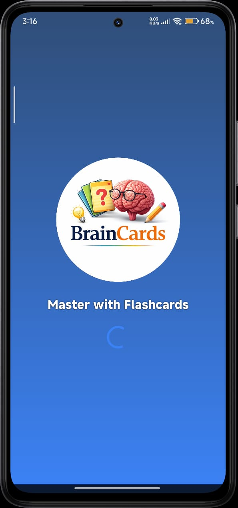
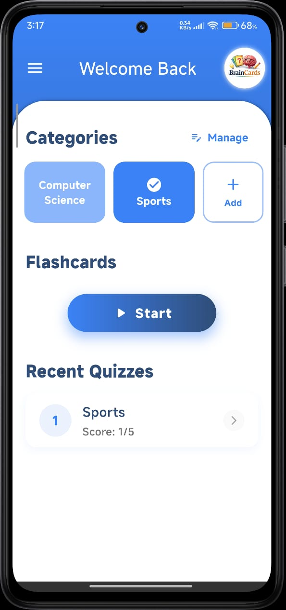
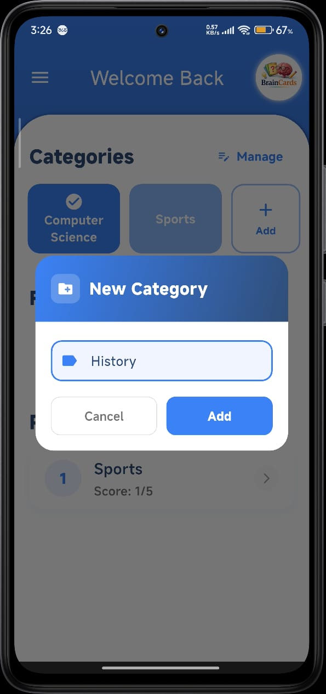
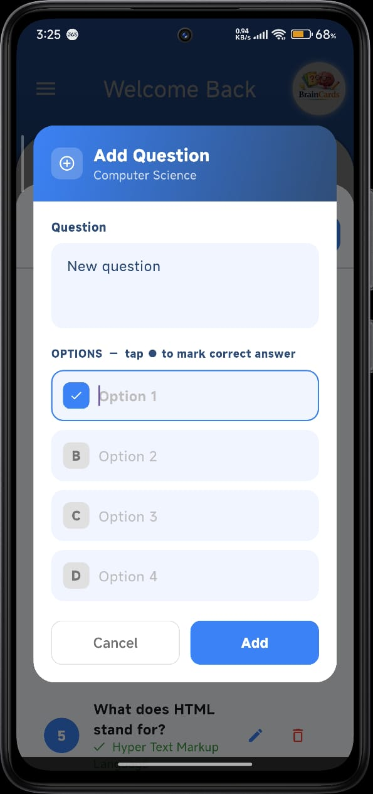
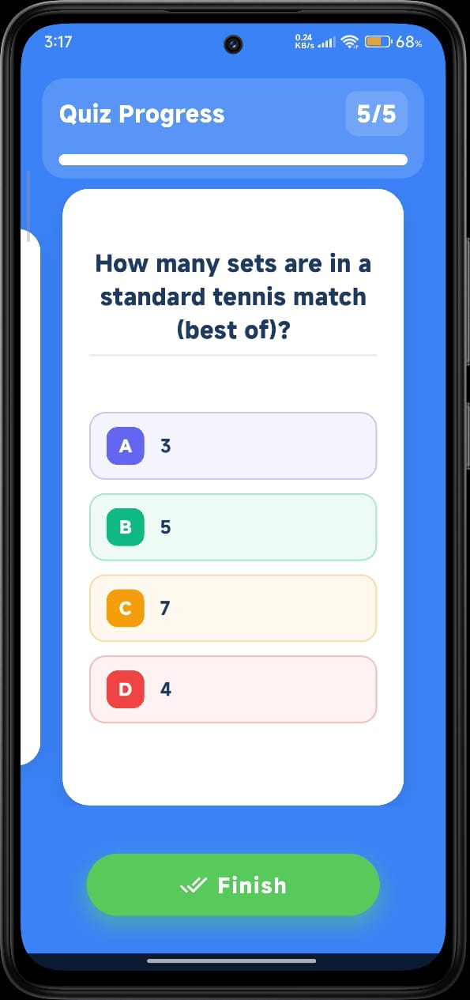
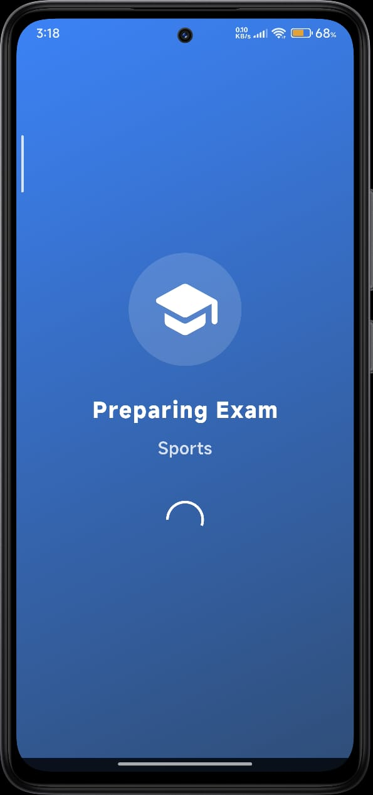

# Brain Cards

[](https://github.com/David-wasem/brain_cards/releases/latest/download/Brain_Cards.apk)

**Brain Cards** is a dynamic and user-friendly quiz application designed to make learning fun and efficient. Built with Flutter, it features a modern interface, smart progress tracking, and a variety of quiz modes to cater to every learning style.

## ✨ Key Features

### 🧠 Dynamic Quiz Interface
- **Card-Based Learning**: Navigate through questions with an intuitive **Carousel Slider**. Swipe or tap to move between cards, keeping the focus on one question at a time.
- **Smart Navigation**: Intelligent buttons that adapt to your progress. **Previous** always takes you back to review, while **Next** either moves to the next card or triggers the results screen upon completion.

### 🎯 Adaptive Grading System
- **Real-Time Feedback**: Receive immediate visual confirmation for correct (green checkmark) and incorrect (red cross) answers.
- **Auto-Correct**: For incorrect answers, the app automatically reveals the correct answer and provides a concise explanation, ensuring you learn from every mistake.
- **Progress Sync**: The progress bar at the top of the screen updates instantly with each answer, giving you a clear overview of your performance.

### 📊 Smart Analytics
- **Visual Dashboard**: Upon completion, get a comprehensive results screen featuring a visually appealing **Radial Progress Indicator**.
- **Performance Metrics**: Clearly displays your score, total questions, and accuracy rate.
- **Time Tracking**: Monitor your performance with detailed statistics on your speed and efficiency.

### 📚 Category Management
- **Organized Library**: Manage your quizzes by category (e.g., "Python," "Biology").
- **Quick Add**: Easily create new categories with a simple dialog and dedicated icon.
- **Recent Activity**: A "Recently Played" section on the homepage lets you jump back into your last quiz instantly.

### 🎨 Polished UI/UX
- **Modern Design**: Features a clean, vibrant interface with a focus on readability and user engagement.
- **Smooth Animations**: Includes smooth transitions, loading states, and interactive effects for a premium feel.
- **Custom Widgets**: Utilizes custom components like `CustomCard`, `QuizProgress`, and `LeaveConfirmation` to maintain a consistent and professional look.

## 🛠️ Tech Stack

- **Framework**: Flutter
- **State Management**: `setState` with clear separation of concerns
- **Navigation**: `Navigator` and `showDialog` for in-app routing
- **UI Components**:
  - `CarouselSlider` for horizontal scrolling
  - `AnimatedSwitcher` for state transitions
  - `RadialProgressIndicator` for visual feedback
  - `CardFlipAnimation` for card flipping animation

## 🚀 Getting Started

1. Clone the repository.
2. Run `flutter pub get` to install dependencies.
3. Launch the app using `flutter run`.

## 📦 Core Dependencies

- [carousel_slider](https://pub.dev/packages/carousel_slider) - Used for the smooth, horizontal question navigation.
- [flutter_flip_card](https://pub.dev/packages/flutter_flip_card) - Provides the interactive card flipping animations for answers.
- [linear_progress_bar](https://pub.dev/packages/linear_progress_bar) - Used for the real-time exam progress indicator.
- [flutter_launcher_icons](https://pub.dev/packages/flutter_launcher_icons) - Used for the app icon generation.

## 📂 Project Structure

```text
lib/
├── models/         # Data models (Quiz, Result, QuizList)
├── screens/        # Main application screens (Home, Exam)
├── widgets/        # Reusable UI components (CustomCard, Drawer, Progress)
└── main.dart       # Application entry point and theme configuration
```

## 📸 Screenshots

<p align="center">
  
  &nbsp; &nbsp; &nbsp;
  
  &nbsp; &nbsp; &nbsp;
  
  &nbsp; &nbsp; &nbsp;
  
  &nbsp; &nbsp; &nbsp;
  
  &nbsp; &nbsp; &nbsp;
  
</p>

## 🤝 Contributing

Contributions, issues, and feature requests are welcome! 
Feel free to check the [issues page](#) if you want to contribute.

1. Fork the Project
2. Create your Feature Branch (`git checkout -b feature/AmazingFeature`)
3. Commit your Changes (`git commit -m 'Add some AmazingFeature'`)
4. Push to the Branch (`git push origin feature/AmazingFeature`)
5. Open a Pull Request
